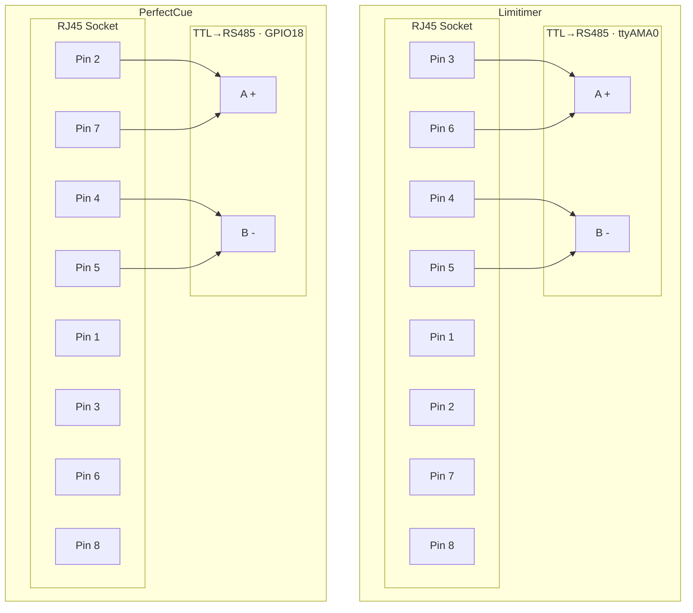
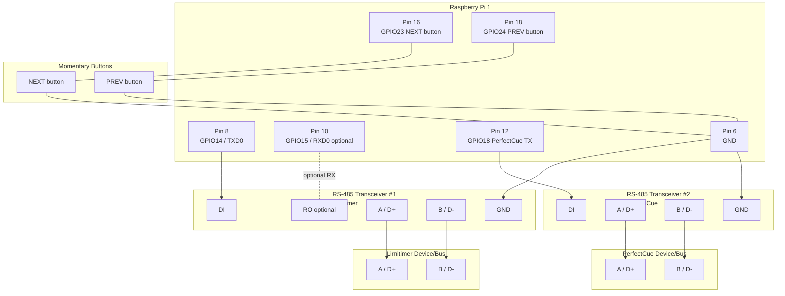

# PiTG

PiTG is a Raspberry Pi 1 focused timecode/protocol toolkit.

It now contains two runtime outputs:

- `pitg`: SMPTE LTC over analog audio (3.5mm jack) using ALSA + libltc
- `pitg-gpio`: Limitimer/PerfectCue protocol output with split transport support

## Table of Contents

- [Plan of Action (Wiring)](#plan-of-action-wiring)
- [Why This Fork](#why-this-fork)
- [Requirements](#requirements)
- [Build](#build)
- [1) LTC Audio Generator (`pitg`)](#1-ltc-audio-generator-pitg)
- [2) Protocol Output (`pitg-gpio`)](#2-protocol-output-pitg-gpio)
- [Recommended Split (Limitimer Critical, PerfectCue Occasional)](#recommended-split-limitimer-critical-perfectcue-occasional)
- [Raspberry Pi 1 Wiring (Split Mode)](#raspberry-pi-1-wiring-split-mode)
  - [RJ45 Connector Wiring (Limitimer / PerfectCue)](#rj45-connector-wiring-limitimer--perfectcue)
  - [Wiring Diagram (with Buttons)](#wiring-diagram-with-buttons)
  - [Pin 13 Ambiguity (Pi 1)](#pin-13-ambiguity-pi-1)
- [Wiring Verification (Debug First)](#wiring-verification-debug-first)
- [Protocol Payload Templates](#protocol-payload-templates)
- [Install And Enable Services](#install-and-enable-services)
- [Service Configuration](#service-configuration)
- [Harness Helper](#harness-helper)
- [Notes For Raspberry Pi 1](#notes-for-raspberry-pi-1)

## Plan of Action (Wiring)

1. Limitimer path: pin 8 (GPIO14/TXD0) -> RS-485 DI, plus GND, then A/B to Limitimer.
2. PerfectCue path: pin 12 (GPIO18) -> RS-485 DI, plus GND, then A/B to PerfectCue.
3. Buttons: NEXT pin 16 (GPIO23) to GND, PREV pin 18 (GPIO24) to GND.
4. Manual DE/RE boards: set DE=HIGH and RE=HIGH (TX-only).
5. Start and check: `sudo pitg-harnessctl status`.
6. Test order: confirm Limitimer stream, then press NEXT/PREV and verify cue reception.
7. If no comms: swap A/B, confirm `19200 8N1`, recheck shared ground and termination.

## Why This Fork

You asked for a project fork that can output both Limitimer protocol and PerfectCue protocol on Raspberry Pi 1.

This repository now ships that GPIO path in a separate binary so your existing LTC audio workflow stays intact.

## Requirements

On Raspberry Pi OS:

- `gcc`
- `make`
- `libltc-dev`
- `libasound2-dev`
- `libgpiod-dev`

Install build dependencies:

```bash
make deps
```

## Build

```bash
make
```

Build outputs:

- `pitg`
- `pitg-gpio`
- `pitg-harnessctl`
- `pitg-cue-buttons`

## 1) LTC Audio Generator (`pitg`)

Run with defaults:

```bash
./pitg
```

Common options:

- `-r <fps>`: `24 | 25 | 29.97 | 29.97df | 30`
- `-a <hz>`: sample rate (`8000-192000`)
- `-d <device>`: ALSA device
- `-s <HH:MM:SS:FF>`: fixed start timecode

Example:

```bash
./pitg -r 25 -a 48000 -d plughw:CARD=Headphones,DEV=0
```

## 2) Protocol Output (`pitg-gpio`)

`pitg-gpio` supports two transport paths:

- Limitimer over hardware UART (`-u /dev/ttyAMA0` recommended on Pi 1)
- PerfectCue over GPIO bit-banged serial using libgpiod

Supported protocol modes:

- `limitimer`
- `perfectcue`
- `both`

Run defaults (Limitimer stream):

```bash
./pitg-gpio
```

CLI options:

- `-p <protocol>`: `limitimer | perfectcue | both` (default: `both`)
- `-u <tty>`: UART device for Limitimer output (example: `/dev/ttyAMA0`)
- `-g <gpio>`: Limitimer GPIO pin (default: `17`)
- `-q <gpio>`: PerfectCue GPIO pin (default: `18`)
- `-x <cmd>`: PerfectCue command: `next | prev | blank-off | blank-on` (default: `next`)
- `-b <baud>`: UART/serial baud rate (default: `19200`)
- `-i <ms>`: transmission interval in ms (default: `1000`)
- `-c <index>`: gpiochip index (default: `0`)
- `-1`: one-shot mode (send one event/frame and exit)

Examples:

```bash
./pitg-gpio -p limitimer -u /dev/ttyAMA0 -b 19200 -i 250
./pitg-gpio -p perfectcue -q 18 -x next -b 19200 -i 250
./pitg-gpio -p both -u /dev/ttyAMA0 -q 18 -x blank-on -b 19200 -i 250
./pitg-gpio -p perfectcue -q 18 -x blank-on -b 19200 -1
```

## Recommended Split (Limitimer Critical, PerfectCue Occasional)

If Limitimer is the primary stream and PerfectCue is occasional, run them separately:

1. Continuous service for Limitimer only.
2. Fire PerfectCue events as one-shot commands when needed.

Example service options for Limitimer stream on Pi 1 UART:

```bash
PITG_GPIO_OPTS="-p limitimer -u /dev/ttyAMA0 -b 19200 -i 250 -c 0"
```

When using `pitg-cue-buttons.service`, keep `pitg-gpio.service` in Limitimer-only mode
so GPIO18 is not double-claimed.

Example occasional PerfectCue commands:

```bash
./pitg-gpio -p perfectcue -q 18 -x next -b 19200 -1
./pitg-gpio -p perfectcue -q 18 -x prev -b 19200 -1
./pitg-gpio -p perfectcue -q 18 -x blank-on -b 19200 -1
./pitg-gpio -p perfectcue -q 18 -x blank-off -b 19200 -1
```

## Raspberry Pi 1 Wiring (Split Mode)

Recommended on Pi 1:

- Limitimer stream on hardware UART (`/dev/ttyAMA0`) through RS-485 transceiver #1
- PerfectCue occasional events on GPIO through RS-485 transceiver #2

Pin map (40-pin header numbering):

- UART TXD0: BCM `GPIO14`, physical pin `8` -> Limitimer transceiver DI
- UART RXD0: BCM `GPIO15`, physical pin `10` (optional for TX-only)
- PerfectCue TX GPIO: BCM `GPIO18`, physical pin `12` -> PerfectCue transceiver DI
- PerfectCue NEXT button input: BCM `GPIO23`, physical pin `16`
- PerfectCue PREV button input: BCM `GPIO24`, physical pin `18`
- Ground: physical pin `6` (or any GND)

Button wiring (default active-low):

- One side of each momentary button -> GPIO input pin (`GPIO23` or `GPIO24`)
- Other side of each button -> GND
- Use external pull-up resistors to 3.3V (for example 10k) unless you provide another pull strategy
- If your buttons are wired active-high, run `pitg-cue-buttons` with `-H`

RS-485 line side:

- Transceiver #1 A/B -> Limitimer A/B
- Transceiver #2 A/B -> PerfectCue A/B

### RJ45 Connector Wiring (Limitimer / PerfectCue)

Use this when building RJ45 breakout/cable adapters for DSAN bus devices. Each device gets its own RS-485 transceiver board and its own RJ45 cable. The pin routing below follows the reference diagram exactly.



Pin groups shown in the diagram:
- Limitimer socket: `3 + 6` to `A (+)`, and `4 + 5` to `B (-)`.
- PerfectCue socket: `2 + 7` to `A (+)`, and `4 + 5` to `B (-)`.

### Wiring Diagram (with Buttons)



### Pin 13 Ambiguity (Pi 1)

Early Raspberry Pi board revisions mapped physical pin 13 differently (`GPIO21` on rev1 boards, `GPIO27` on later revisions). To avoid this ambiguity, use physical pin 12 (`GPIO18`) for PerfectCue output.

References:

- Raspberry Pi pinout with rev1/rev2 notes: https://pinout.xyz/pinout/pin13_gpio27
- Raspberry Pi GPIO basics and board docs: https://www.raspberrypi.com/documentation/computers/raspberry-pi.html

Check your board revision on-device:

```bash
cat /proc/cpuinfo | grep Revision
```

## Wiring Verification (Debug First)

Treat the wiring diagram as a starting hypothesis and verify on hardware.

1. Start with one link at a time (Limitimer first, then PerfectCue).
2. Confirm UART TX is active on Pi pin 8 while Limitimer stream is running.
3. Confirm PerfectCue GPIO pin toggles only when one-shot command is sent.
4. If there is no communication, swap A/B on that specific RS-485 link.
5. For manual DE/RE boards, force TX-only (`DE=HIGH`, `RE=HIGH`).
6. Verify `19200 8N1` on both sides.
7. Add/confirm 120 ohm termination only at bus ends.

Recommended quick debug commands:

```bash
# Limitimer continuous stream over UART
./pitg-gpio -p limitimer -u /dev/ttyAMA0 -b 19200 -i 250

# PerfectCue one-shot tests over GPIO18
./pitg-gpio -p perfectcue -q 18 -x next -b 19200 -1
./pitg-gpio -p perfectcue -q 18 -x prev -b 19200 -1
./pitg-gpio -p perfectcue -q 18 -x blank-on -b 19200 -1
./pitg-gpio -p perfectcue -q 18 -x blank-off -b 19200 -1
```

## Protocol Payload Templates

Current implementation uses reverse-engineered protocol framing from the
`Depili/limitimer` and `clock8002` references:

- Limitimer:
	- Transport: RS-485, `19200 8N1`
	- Packet framing: starts `0x81`, payload bytes use 7-bit values,
		checksum marker `0x83`, CRC16/Modbus (2 bytes), end `0xFF`
	- Status packet type `0x00`, 55-byte packet generated by
		`build_limitimer_status_packet()` in `pitg_gpio.c`
- PerfectCue:
	- Transport: `19200 8N1`
	- Commands emitted as one-byte events:
		- `0x0F` next/right
		- `0x1F` previous/left
		- `0x2F` blank off
		- `0x3F` blank on

If your specific hardware revision needs different behavior, edit:

- `build_limitimer_status_packet()` in `pitg_gpio.c`
- `perfectcue_command_byte()` in `pitg_gpio.c`

## Install And Enable Services

Install binaries and service files:

```bash
sudo make install-service
```

Enable services:

```bash
sudo make enable-service
```

This installs:

- `/usr/local/bin/pitg`
- `/usr/local/bin/pitgctl`
- `/usr/local/bin/pitg-harnessctl`
- `/usr/local/bin/pitg-gpio`
- `/usr/local/bin/pitg-cue-buttons`
- `/etc/systemd/system/pitg.service`
- `/etc/systemd/system/pitg-gpio.service`
- `/etc/systemd/system/pitg-cue-buttons.service`
- `/etc/default/pitg` (if missing)
- `/etc/default/pitg-gpio` (if missing)
- `/etc/default/pitg-cue-buttons` (if missing)

## Service Configuration

LTC audio service config:

- `/etc/default/pitg`

GPIO protocol service config:

- `/etc/default/pitg-gpio`

Default GPIO service options:

```bash
PITG_GPIO_OPTS="-p limitimer -u /dev/ttyAMA0 -b 19200 -i 250 -c 0"
```

Restart after changes:

```bash
sudo systemctl restart pitg-gpio.service
```

## Harness Helper

`pitg-harnessctl` controls the full test harness (both services) and can send one-shot PerfectCue events.

```bash
sudo pitg-harnessctl start
sudo pitg-harnessctl status
sudo pitg-harnessctl logs
sudo pitg-harnessctl cue next
sudo pitg-harnessctl cue blank-on
sudo pitg-harnessctl restart
sudo pitg-harnessctl stop
```

## Notes For Raspberry Pi 1

- Use physical GPIO level shifting/isolation if the destination system requires it.
- Verify pin numbering against BCM GPIO numbers (the tool uses BCM indexes).
- For protocol verification, check output with a logic analyzer or oscilloscope.
- Pi 1 UART0 pins are GPIO14 (TXD0, pin 8) and GPIO15 (RXD0, pin 10).
