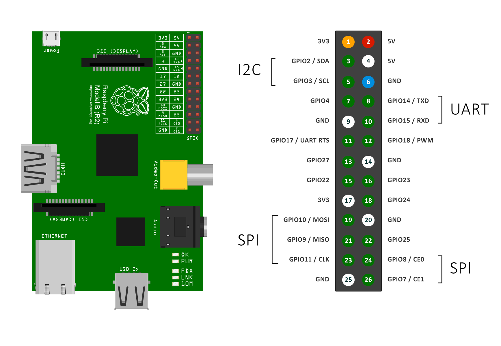
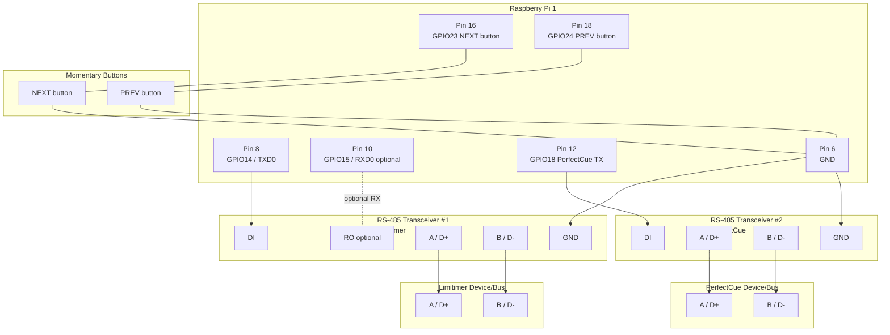

# PiTG

PiTG is a Raspberry Pi 1 timecode and protocol bridge. It provides three runtime outputs:

- **`pitg`** — SMPTE LTC over analog audio (3.5mm jack) via ALSA + libltc
- **`pitg-gpio`** — Limitimer protocol stream over hardware UART or GPIO bit-bang
- **`pitg-cue-buttons`** — PerfectCue cue button bridge via USB RS-485 adapter with hardware button inputs

The Limitimer and PerfectCue paths operate on separate serial devices and run simultaneously.

## Table of Contents

- [Overview](#overview)
- [Requirements](#requirements)
- [Build](#build)
- [Binaries](#binaries)
  - [LTC Audio Generator (`pitg`)](#ltc-audio-generator-pitg)
  - [Protocol Output (`pitg-gpio`)](#protocol-output-pitg-gpio)
  - [Cue Button Bridge (`pitg-cue-buttons`)](#cue-button-bridge-pitg-cue-buttons)
- [Deployed Configuration](#deployed-configuration)
- [Raspberry Pi 1 Wiring](#raspberry-pi-1-wiring)
  - [Pin Map](#pin-map)
  - [RS-485 Board Connections](#rs-485-board-connections)
  - [RJ45 Connector Wiring](#rj45-connector-wiring)
  - [Wiring Diagram](#wiring-diagram)
  - [Pin 13 Ambiguity (Pi 1)](#pin-13-ambiguity-pi-1)
- [Wiring Verification](#wiring-verification)
- [Protocol Reference](#protocol-reference)
- [Service Installation](#service-installation)
- [Service Configuration](#service-configuration)
- [Harness Helper](#harness-helper)
- [Notes For Raspberry Pi 1](#notes-for-raspberry-pi-1)

## Overview

PiTG runs on a Raspberry Pi 1 Model B (Rev 2, BCM2835, 26-pin header). It bridges between a timecode source and two DSAN protocol bus devices:

- **Limitimer** receives a continuous status stream over RS-485 at 19200 baud, driven from the Pi's hardware UART (`/dev/ttyAMA0` → HW-0519 auto-direction board).
- **PerfectCue** receives one-shot cue commands over RS-485 at 19200 baud, driven by `pitg-cue-buttons` via a Waveshare USB-TO-RS485(B) adapter (CH343G + SP485EEN, with hardware TNOW-based direction control).
- **Buttons** (NEXT/PREV) are wired to GPIO inputs and drive PerfectCue events when pressed.

## Requirements

On Raspberry Pi OS:

- `gcc`
- `make`
- `libltc-dev`
- `libasound2-dev`
- `libgpiod-dev`

Install build dependencies:

```bash
make deps
```

## Build

```bash
make
```

Build outputs:

- `pitg`
- `pitg-gpio`
- `pitg-harnessctl`
- `pitg-cue-buttons`

## Binaries

### LTC Audio Generator (`pitg`)

Generates SMPTE LTC timecode signal over the Pi's 3.5mm analog audio jack via ALSA.

Run with defaults:

```bash
./pitg
```

Common options:

- `-r <fps>`: `24 | 25 | 29.97 | 29.97df | 30`
- `-a <hz>`: sample rate (`8000-192000`)
- `-d <device>`: ALSA device
- `-s <HH:MM:SS:FF>`: fixed start timecode

Example:

```bash
./pitg -r 25 -a 48000 -d plughw:CARD=Headphones,DEV=0
```

### Protocol Output (`pitg-gpio`)

Outputs a Limitimer protocol stream and/or single PerfectCue cue commands.

Supported protocol modes:

- `limitimer`
- `perfectcue`
- `both`

Run defaults (Limitimer stream):

```bash
./pitg-gpio
```

CLI options:

- `-p <protocol>`: `limitimer | perfectcue | both` (default: `both`)
- `-u <tty>`: UART device for Limitimer output (example: `/dev/ttyAMA0`)
- `-g <gpio>`: Limitimer GPIO pin (default: `17`)
- `-q <gpio>`: PerfectCue GPIO pin (default: `18`)
- `-x <cmd>`: PerfectCue command: `next | prev | blank-off | blank-on` (default: `next`)
- `-b <baud>`: UART/serial baud rate (default: `19200`)
- `-i <ms>`: transmission interval in ms (default: `1000`)
- `-c <index>`: gpiochip index (default: `0`)
- `-t <MM:SS|seconds>`: countdown total time (default: `10:00`)
- `-T`: test mode — auto-fires every 10 seconds alternating next/prev
- `-1`: one-shot mode (send one event/frame and exit)

Examples:

```bash
./pitg-gpio -p limitimer -u /dev/ttyAMA0 -b 19200 -i 250
./pitg-gpio -p perfectcue -q 18 -x next -b 19200 -1
./pitg-gpio -p both -u /dev/ttyAMA0 -q 18 -x blank-on -b 19200 -i 250
./pitg-gpio -p perfectcue -q 18 -x blank-on -b 19200 -1
```

### Cue Button Bridge (`pitg-cue-buttons`)

Monitors hardware button inputs (GPIO) and fires PerfectCue commands over a USB RS-485 adapter when pressed.

CLI options:

- `-N <gpio>`: NEXT button GPIO (default: `23`)
- `-P <gpio>`: PREV button GPIO (default: `24`)
- `-S <tty>`: USB RS-485 serial device
- `-B <baud>`: baud rate (default: `19200`)
- `-D <ms>`: debounce delay in ms (default: `120`)
- `-c <index>`: gpiochip index (default: `0`)
- `-H`: active-high button logic (default: active-low, contacts to GND)
- `-T`: test mode — auto-fires every 10 seconds alternating next/prev

## Deployed Configuration

The deployed system on PiTG uses stable udev symlinks for the USB serial adapters:

- `/dev/ttyLimitimer` → Limitimer output for `pitg-gpio`
- `/dev/ttyRS485` → PerfectCue RS-485 output for `pitg-cue-buttons`

The receiver (`piclocktg`, a Pi 5) receives the Limitimer stream on `/dev/ttyAMA1` (GPIO0/GPIO1). Clock configuration is at:

```
/boot/firmware/piclock/clock.ini
```

Recommended service options:

```bash
PITG_GPIO_OPTS="-p limitimer -u /dev/ttyLimitimer -b 19200 -i 250 -c 0 -t 10:00"
PITG_CUE_BUTTONS_OPTS="-N 23 -P 24 -S /dev/ttyRS485 -B 19200 -D 120 -c 0 -T"
```

Notes:

- `pitg-gpio.service` runs in Limitimer-only mode continuously.
- `pitg-cue-buttons.service` handles PerfectCue events via hardware buttons; `-T` enables automatic test firing on boot.
- Remove `-T` from `pitg-cue-buttons` for live show operation.

## Raspberry Pi 1 Wiring

Recommended configuration for Pi 1 Model B Rev 2 (26-pin header):

- Limitimer stream: hardware UART (`/dev/ttyAMA0`) → RS-485 transceiver #1
- PerfectCue events: USB RS-485 adapter (`pitg-cue-buttons`) → RS-485 transceiver #2



### Pin Map

Physical pin numbers (26-pin header):

| Signal | BCM GPIO | Physical Pin |
|---|---|---|
| UART TXD0 (Limitimer) | GPIO14 | 8 |
| UART RXD0 (optional) | GPIO15 | 10 |
| PerfectCue TX (GPIO) | GPIO18 | 12 |
| NEXT button input | GPIO23 | 16 |
| PREV button input | GPIO24 | 18 |
| Ground | — | 6 |

Button wiring (default active-low):

- One side of each momentary button → GPIO input pin (`GPIO23` or `GPIO24`)
- Other side of each button → GND
- No external pull-up resistors needed — `pitg-cue-buttons` enables internal pull-ups via libgpiod
- If buttons are wired active-high, use `-H`

RS-485 line side:

- Transceiver #1 A/B → Limitimer A/B
- Transceiver #2 A/B → PerfectCue A/B

### RS-485 Board Connections

These boards auto-switch direction (no DE/RE wiring needed). Use 5V for VCC.

**Limitimer** — RS-485 board → UART `/dev/ttyAMA0`:

| Board pin | Connect to |
|---|---|
| **TXD** | Pi pin 8 (GPIO14 / TXD0) |
| **RXD** | leave unconnected |
| **VCC** | Pi pin 2 (5V) |
| **GND** | Pi pin 6 (GND) |
| **A+** | RJ45 Limitimer A pins (3 + 6) |
| **B-** | RJ45 Limitimer B pins (4 + 5) |
| **接大地** | leave unconnected |

**PerfectCue** — RS-485 board → GPIO18:

| Board pin | Connect to |
|---|---|
| **TXD** | Pi pin 12 (GPIO18) |
| **RXD** | leave unconnected |
| **VCC** | Pi pin 2 (5V) |
| **GND** | Pi pin 6 (GND) |
| **A+** | RJ45 PerfectCue A pins (2 + 7) |
| **B-** | RJ45 PerfectCue B pins (4 + 5) |
| **接大地** | leave unconnected |

### RJ45 Connector Wiring

Use when building RJ45 breakout/cable adapters for DSAN bus devices. Each device gets its own RS-485 transceiver board and its own RJ45 cable.

```
  Limitimer RJ45              TTL→RS485          PerfectCue RJ45             TTL→RS485
  ┌──────────┐               ┌───────┐          ┌──────────┐               ┌───────┐
  │ Pin 1    │               │       │          │ Pin 1    │               │       │
  │ Pin 2    │               │       │          │ Pin 2    ├───────────────┤ A (+) │
  │ Pin 3    ├───────────────┤ A (+) │          │ Pin 3    │               │       │
  │ Pin 4    ├───────────────┤ B (-) │          │ Pin 4    ├───────────────┤ B (-) │
  │ Pin 5    ├───────────────┤ B (-) │          │ Pin 5    ├───────────────┤ B (-) │
  │ Pin 6    ├───────────────┤ A (+) │          │ Pin 6    │               │       │
  │ Pin 7    │               │       │          │ Pin 7    ├───────────────┤ A (+) │
  │ Pin 8    │               │       │          │ Pin 8    │               │       │
  └──────────┘               └───────┘          └──────────┘               └───────┘
                          ttyAMA0                                        GPIO18
```

Pin groups:
- Limitimer socket: `3 + 6` to `A (+)`, and `4 + 5` to `B (-)`.
- PerfectCue socket: `2 + 7` to `A (+)`, and `4 + 5` to `B (-)`.

### Wiring Diagram



### Pin 13 Ambiguity (Pi 1)

Early Raspberry Pi board revisions mapped physical pin 13 differently (`GPIO21` on rev1 boards, `GPIO27` on later revisions). Use physical pin 12 (`GPIO18`) for PerfectCue output to avoid this ambiguity.

References:

- Raspberry Pi pinout with rev1/rev2 notes: https://pinout.xyz/pinout/pin13_gpio27
- Raspberry Pi GPIO basics and board docs: https://www.raspberrypi.com/documentation/computers/raspberry-pi.html

Check board revision:

```bash
cat /proc/cpuinfo | grep Revision
```

## Wiring Verification

Start with one link at a time (Limitimer first, then PerfectCue), and verify on hardware:

1. Confirm UART TX is active on Pi pin 8 while the Limitimer stream is running.
2. Confirm the PerfectCue GPIO pin toggles only when a one-shot command is sent.
3. If there is no communication, swap A/B on that specific RS-485 link.
4. For manual DE/RE boards, force TX-only (`DE=HIGH`, `RE=HIGH`).
5. Verify `19200 8N1` on both sides.
6. Add/confirm 120 ohm termination only at bus ends.

Quick debug commands:

```bash
# Limitimer continuous stream over UART
./pitg-gpio -p limitimer -u /dev/ttyAMA0 -b 19200 -i 250

# PerfectCue one-shot tests over GPIO18
./pitg-gpio -p perfectcue -q 18 -x next -b 19200 -1
./pitg-gpio -p perfectcue -q 18 -x prev -b 19200 -1
./pitg-gpio -p perfectcue -q 18 -x blank-on -b 19200 -1
./pitg-gpio -p perfectcue -q 18 -x blank-off -b 19200 -1
```

## Protocol Reference

- **Limitimer**
  - Transport: RS-485, `19200 8N1`
  - Packet framing: starts `0x81`, payload bytes use 7-bit values, checksum marker `0x83`, CRC16/Modbus (2 bytes), end `0xFF`
  - Status packet type `0x00`, 55-byte packet generated by `build_limitimer_status_packet()` in `pitg_gpio.c`
- **PerfectCue**
  - Transport: `19200 8N1`
  - Single-byte commands:
    - `0x0F` next/right
    - `0x1F` previous/left
    - `0x2F` blank off
    - `0x3F` blank on

To modify packet behavior, edit `build_limitimer_status_packet()` or `perfectcue_command_byte()` in `pitg_gpio.c`.

## Service Installation

Install binaries and service files:

```bash
sudo make install-service
```

Enable services:

```bash
sudo make enable-service
```

This installs:

- `/usr/local/bin/pitg`
- `/usr/local/bin/pitgctl`
- `/usr/local/bin/pitg-harnessctl`
- `/usr/local/bin/pitg-gpio`
- `/usr/local/bin/pitg-cue-buttons`
- `/etc/systemd/system/pitg.service`
- `/etc/systemd/system/pitg-gpio.service`
- `/etc/systemd/system/pitg-cue-buttons.service`
- `/etc/default/pitg` (if missing)
- `/etc/default/pitg-gpio` (if missing)
- `/etc/default/pitg-cue-buttons` (if missing)

## Service Configuration

| Service | Config file |
|---|---|
| LTC audio (`pitg`) | `/etc/default/pitg` |
| Limitimer transmitter (`pitg-gpio`) | `/etc/default/pitg-gpio` |
| PerfectCue button bridge (`pitg-cue-buttons`) | `/etc/default/pitg-cue-buttons` |
| Receiver clock (`piclocktg`) | `/boot/firmware/piclock/clock.ini` |

### PerfectCue Contact Closure Controls

Verified button/contact closure inputs for `pitg-cue-buttons`:

- NEXT: BCM `GPIO23`, physical pin `16`
- PREV: BCM `GPIO24`, physical pin `18`
- Both contacts close to `GND`
- Default logic is active-low
- Use `-H` only if contacts are wired active-high

### Test Mode

`-T` on `pitg-cue-buttons` enables automatic PerfectCue firing once every 10 seconds, alternating `NEXT` and `PREV`. This is the default boot test mode. Remove `-T` for live show operation.

Restart after config changes:

```bash
sudo systemctl restart pitg-gpio.service
sudo systemctl restart pitg-cue-buttons.service
```

## Harness Helper

`pitg-harnessctl` controls both services and can send one-shot PerfectCue events:

```bash
sudo pitg-harnessctl start
sudo pitg-harnessctl status
sudo pitg-harnessctl logs
sudo pitg-harnessctl cue next
sudo pitg-harnessctl cue blank-on
sudo pitg-harnessctl restart
sudo pitg-harnessctl stop
```

## Notes For Raspberry Pi 1

- Pi 1 UART0 pins: GPIO14 (TXD0, pin 8) and GPIO15 (RXD0, pin 10).
- GPIO numbering follows BCM convention throughout.
- The HW-0519 auto-direction RS-485 board is suitable for the Limitimer continuous stream. For isolated single-byte commands (PerfectCue), use a board with proper hardware direction control (e.g. Waveshare USB-TO-RS485(B) with TNOW).
- If getting inverted data (e.g. `0x0F` received as `0x78`), swap the A/B wires.
- For protocol verification, use a logic analyzer or oscilloscope on the RS-485 bus.
- Use physical GPIO level shifting/isolation if the destination system requires 5V signaling.
